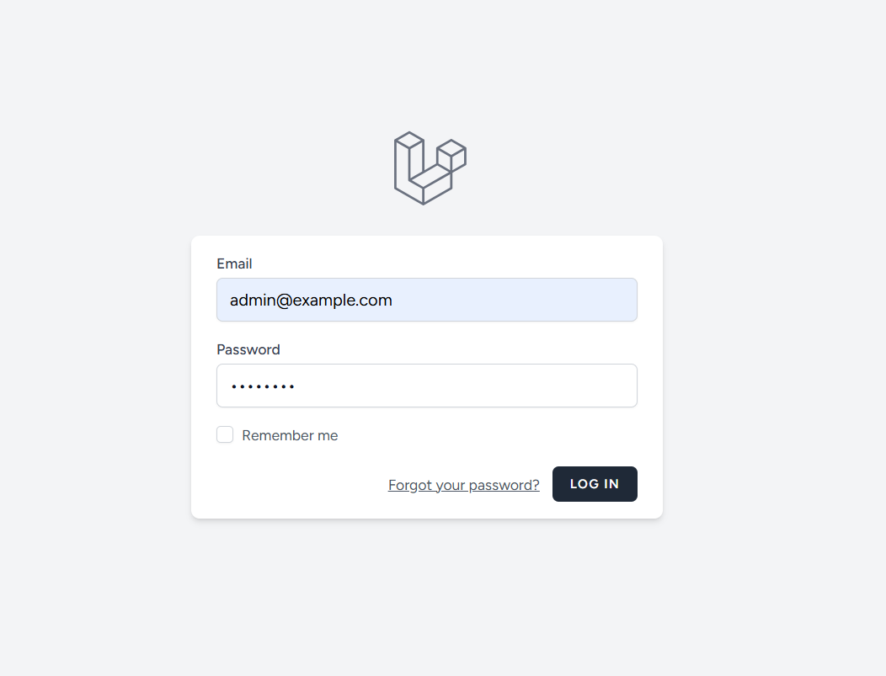
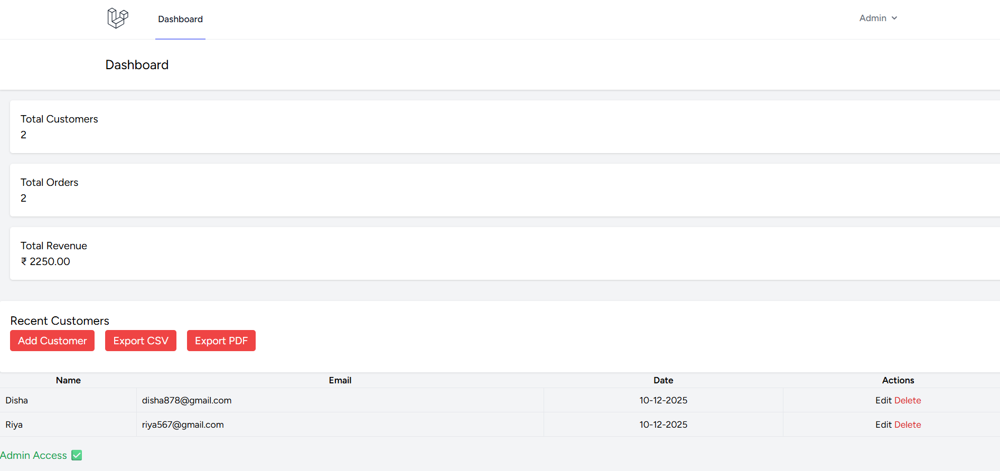
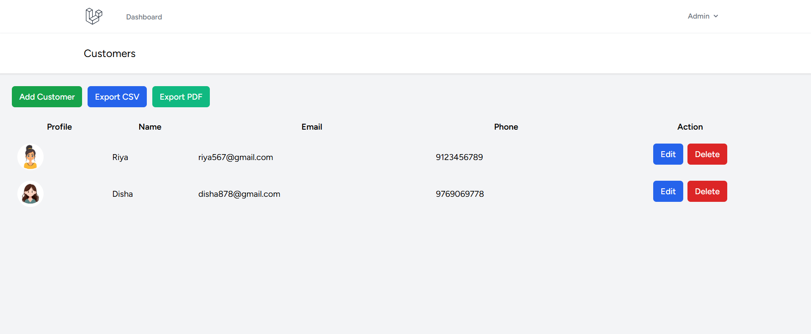
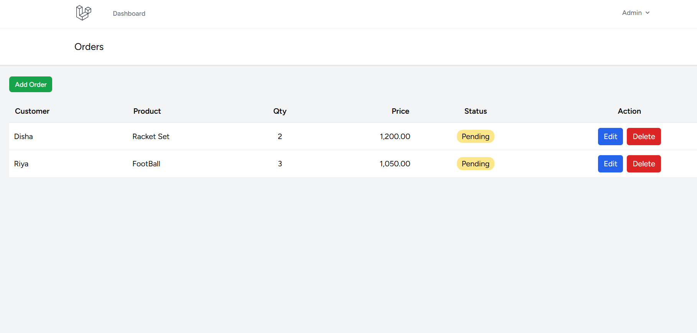
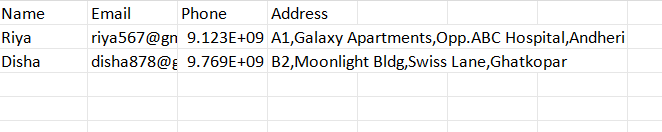

# ImpactGuru Mini CRM – Internship Project

## Company
ImpactGuru

## Project Title
ImpactGuru Mini CRM – Customer & Order Management System

## Developer
Name: Bharati Jain  
Email: bharatijain802@gmail.com  

## Overview 
This project is a Mini CRM system built using Laravel as part of the ImpactGuru Internship assignment.

The system helps manage:
- Customers
- Orders
- User roles (Admin & Staff)
- Order statuses
- Dashboard analytics
- Data export (CSV/PDF)

It demonstrates practical use of Laravel authentication, Blade UI, Eloquent ORM, routing, validation, and role-based access control.

## Modules Implemented

### Authentication
- Login / Logout
- Role-based access (Admin / Staff)

### Dashboard
- Total customers
- Total orders
- Revenue summary
- Recent customers list
- Export customers list as PDF/CSV File

### Customer Management
- Add customer
- Edit customer
- Delete customer
- Profile image upload

### Orders Management
The Orders module allows Admin users to:

- Add new orders
- View all orders
- Edit order details
- Delete orders
- Export orders as CSV/PDF file

Each order includes:
- Customer name
- Product name
- Quantity
- Price
- Status (default: Pending)

### Role Permissions
#### Admin:
- Full access
- Can add/edit/delete customers
- Can export orders as pdf/csv file

#### Staff:
- Read-only access
- Can view dashboard
- Cannot modify records

## Tech Stack

- Laravel
- PHP
- MySQL
- Blade
- Bootstrap / Tailwind
- GitHub

## Screenshots

### 1. Login Page

*Sample credentials: admin@example.com / password*

### 2. Dashboard

*Shows total customers, total orders, revenue summary, and recent customers.*

### 3. Customer Management

*List of customers with add, edit, delete, and profile image upload options.*

### 4. Orders Management

*Shows orders with product names, quantities, prices, statuses, and search.*

### 5. Export Feature

*Demonstrates CSV/PDF export functionality.*

## How to Run the Project

## Setup Environment

1. Copy `.env.example` to `.env`:
   cp .env.example .env
   
2. Update .env with your local database credentials and other keys (like DB username, password, and app keys).

## Setup Database
1. Import the database dump:
2. 
mysql -u <db_username> -p <database_name> < database.sql

Example:
mysql -u root -p customer_crm_db < database.sql

## How to Run the Project
1. Clone the repository:
git clone <repo-link>
cd project-folder

2. Install PHP and Node dependencies:
composer install
npm install

3. Generate the Laravel application key:
php artisan key:generate

4. Serve the application locally:
php artisan serve

5. Open the project in your browser:
http://localhost:8000

