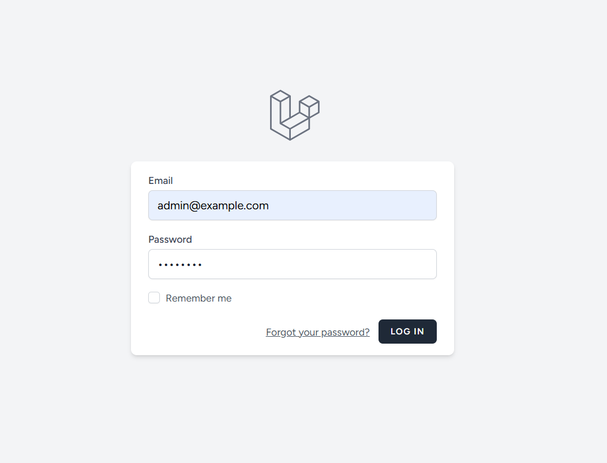
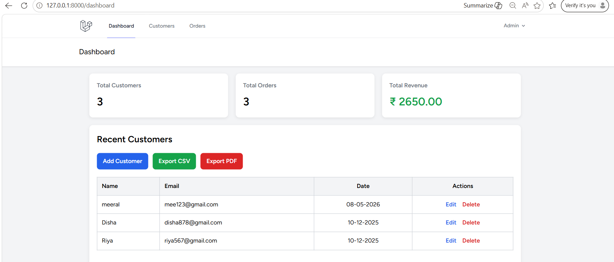
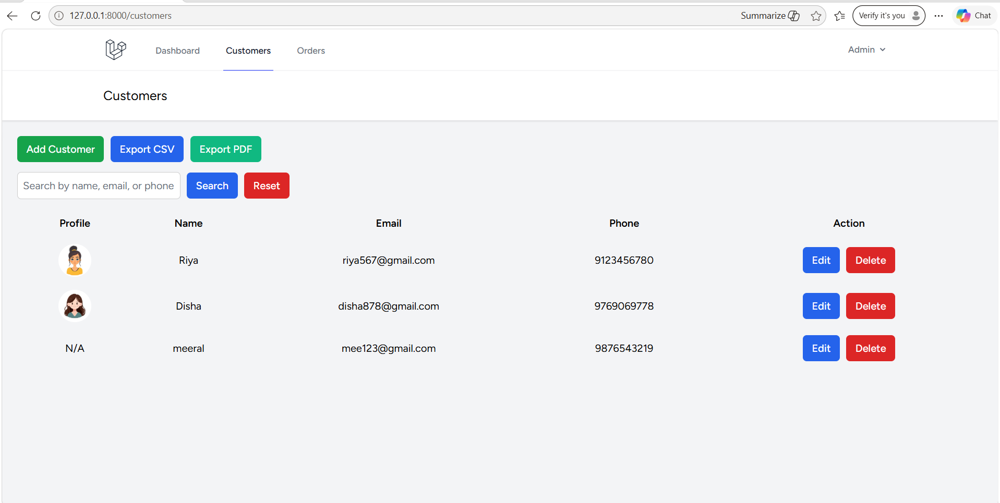
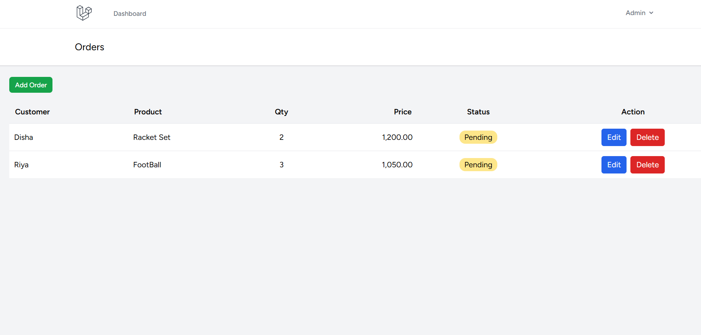
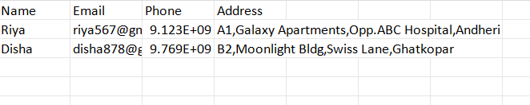

## Project Title
ClientFlow CRM – Customer & Order Management System


## Developer
Name: Bharati Jain  
Email: bharatijain802@gmail.com  

## Overview 
ClientFlow CRM is a role-based Customer Relationship Management system built using Laravel.  
It was developed as part of an internship assignment to simulate real-world CRM workflows.

The system manages:
- Customers
- Orders
- User roles (Admin & Staff)
- Order statuses
- Dashboard analytics
- Data export (CSV/PDF)

It demonstrates practical implementation of:
Laravel authentication, Blade UI, Eloquent ORM, routing, validation, and role-based access control.

---

## Key Features
- Role-Based Access Control (Admin & Staff)
- Customer & Order Management (CRUD)
- Dashboard with analytics (customers, orders, revenue)
- Search and filtering support
- Profile image upload
- CSV and PDF export functionality
- Activity tracking (user actions log)
- Pagination support
- Soft delete support

---

## Modules Implemented

### Authentication
- Login / Logout
- Role-based access (Admin / Staff)

  ---

### Dashboard
- Total customers
- Total orders
- Total Revenue
- Recent customers list
- Export data as PDF/CSV File

---

### Customer Management
- Add / Edit / Delete customer
- Profile image upload
- Search & pagination

---


### Orders Management
(Admin only operations)
- Create new orders
- View all orders
- Update order details
- Delete orders
- Export orders as CSV/PDF

Each order includes:
- Customer name
- Product name
- Quantity
- Price

---

### Role Permissions
#### Admin
- Full system access
- Manage customers and orders
- Export reports

#### Staff
- Read-only access
- View dashboard and data
- Cannot modify or delete records

---

## Tech Stack

- Backend: Laravel 10, PHP 8
- Frontend: Blade, Tailwind CSS
- Database: MySQL
- Authentication: Laravel Breeze
- Exports:  CSV Streaming
- Version Control: Git & GitHub

---

## Screenshots

### 1. Login Page

*Sample credentials: admin@example.com / password*

---

### 2. Dashboard

*Displays key metrics and recent customer activity.*

---

### 3. Customer Management

*Manage customers with CRUD and image upload.*

---

### 4. Orders Management

*Order tracking with search and status management.*

---

### 5. Export Feature


*Demonstrates CSV/PDF export functionality.*

---

##  Setup Instructions


 1. Clone Repository
```bash
git clone <repo-link>
cd project-folder

 2. Install Dependencies

composer install
npm install

 3. Environment Setup
cp .env.example .env
php artisan key:generate

Update .env with database credentials.

 4. Database Setup
mysql -u root -p customer_crm_db < database.sql

 5. Run Application
php artisan serve

Open:
http://localhost:8000


